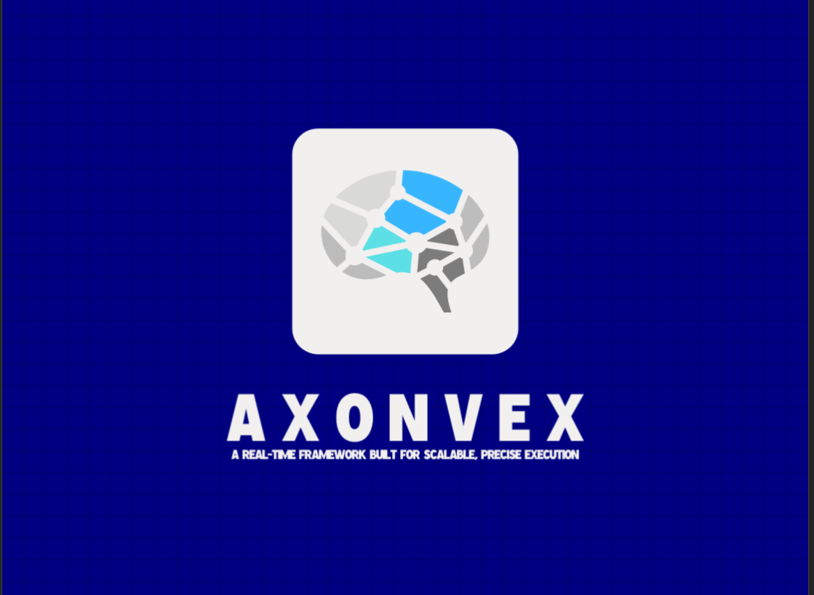

# AxonVex  
**Real-time C++ framework for typed processing pipelines, deterministic scheduling, and extensible protocol adapters**

[](LICENSE)
[](https://github.com/amerghazal7/AxonVex/actions/workflows/ci.yml)
[](docs/)
[]()

---

## Project Status

AxonVex is in active development. The strongest capability today is the core runtime and its test harness. The full v1.0 vision — visualization platform, enterprise security, hardware watchdog, cross-platform support, published performance benchmarks — is scoped and sequenced in the [v1.0 Release Plan](docs/v1_release_plan.md); features below are marked accordingly.

## Mission Statement

AxonVex is a cutting-edge real-time framework designed to empower developers to master the complexity of modern systems with unparalleled speed and scalability. Inspired by the rapid signaling of neural axons and the challenge of solving intricate problems, AxonVex delivers precision orchestration, deterministic execution, and robust performance for real-time applications across industries. We enable seamless, scalable solutions where milliseconds matter and complexity is conquered effortlessly.

---

## Framework Overview

AxonVex is a comprehensive real-time framework built upon proven hierarchical block-based architecture principles. It provides developers with the tools and infrastructure needed to build sophisticated real-time systems with deterministic timing, high performance, and mission-critical reliability.

### Key Features

Legend: plain claims are shipped and backed by code/tests; 🔄 items are **in development — v1.0 roadmap**, each mapped to a workstream (WS-*) in [v1.0 Release Plan §6](docs/v1_release_plan.md).

- 🧩 **Modular Design**: Hierarchical block-based architecture — processing units, typed ports, adapters, and dynamic plugin loading (Linux)
- 🛡️ **Safety Envelope**: `SafetyManager` policy registry with e-stop and a software watchdog — 🔄 hardware watchdog and wired scheduler-halt path in development, v1.0 roadmap (WS-SAFE)
- 🎯 **Precision Execution**: Deterministic scheduling via `TimingController` — 🔄 sub-microsecond-class timing is a v1.0 target with CI-gated benchmarks, in development (WS-PERF); performance targets, see [docs/v1_release_plan.md](docs/v1_release_plan.md)
- ⚡ **High Performance**: 🔄 in development — v1.0 roadmap (WS-PERF); throughput/latency targets will be published as benchmarks, none exist yet — see [docs/v1_release_plan.md](docs/v1_release_plan.md)
- 📈 **Scalable Architecture**: Single-node pipelines today — 🔄 distributed multi-node composition and 10,000+ block soak validation in development, v1.0 roadmap (WS-SCALE)
- 🔍 **Real-time Visualization**: Telemetry pub/sub bus shipped — 🔄 Angular 17+ web dashboard, WebSocket gateway, 3D scene, and topology views in development, v1.0 roadmap (WS-VIZ)
- 🔒 **Enterprise Security**: 🔄 in development — v1.0 roadmap (WS-SEC): TLS, MFA, and role-based access control; not implemented yet
- 🖥️ **Cross-Platform**: Linux supported — 🔄 Windows and macOS support in development, v1.0 roadmap (WS-PLAT)
- 🔧 **Developer-Friendly**: Typed C++ APIs, extensive test suite, architecture and requirements docs — 🔄 API reference, tutorials, and packaging in development (WS-DX)

---

## Documentation Suite

### 📚 [Complete Documentation Index](docs/)
Your starting point for all AxonVex documentation, including quick start guides, examples, and the release plan.

### 🗺️ [v1.0 Release Plan](docs/v1_release_plan.md)
The audited roadmap: defect inventory, workstream table, phased milestones (alpha/beta/rc), and quality gates.

### 🔧 [Technical Specification](docs/software_requirements_specification.md)

Comprehensive technical specification covering:
- Core architecture philosophy and design principles
- Advanced real-time visual monitoring and control systems
- System architecture and component specifications
- Performance requirements (targets; benchmarks pending per the release plan)
- Implementation technology stack and APIs
- Safety and security features
- Development and integration guidelines

### 🏗️ [Architecture Diagram](docs/architecture_and_design.md)
Visual representation of the system architecture including:
- System architecture overview and component relationships
- Communication architecture and protocol abstractions
- Real-time data flow and processing pipelines
- Safety and security architecture diagrams
- Performance monitoring and deployment models
- Plugin architecture and extensibility framework

---

## Quick Start

### System Requirements

- **CPU**: Multi-core processor (Intel Core i7 or AMD Ryzen 7 recommended)
- **RAM**: Minimum 8GB, recommended 16GB+ for complex systems
- **OS**: Linux (Ubuntu 20.04+). Windows 10+ and macOS 10.15+ are 🔄 in development — v1.0 roadmap (WS-PLAT)
- **Compiler**: GCC 9+ or Clang 10+

### Dependencies

- [Conan 2](https://conan.io/) package manager
- [CMake 3.20+](https://cmake.org/)

### Build

```bash
git clone https://github.com/amerghazal7/AxonVex.git
cd AxonVex

# Install dependencies via Conan
conan install . --output-folder=build --build=missing

# Configure and build
cmake -B build -DCMAKE_TOOLCHAIN_FILE=build/conan_toolchain.cmake \
      -DCMAKE_BUILD_TYPE=Debug -DBUILD_TESTING=ON -DBUILD_EXAMPLES=ON
cmake --build build -j$(nproc)

# Run tests
ctest --test-dir build --output-on-failure
```

---

## API Usage

Derive from `AxonVexSystem` to define your processing pipeline, then drive it through the standard lifecycle.

```cpp
#include <axonvex_core/axonvex.hpp>

using namespace axonvex;

class MySystem final : public AxonVexSystem {
  protected:
    bool initializeBlocksLayout() override {
        auto unit = std::make_unique<MyProcessingUnit>("sensor");
        registerProcessingUnit(std::move(unit));
        return true;
    }
};

int main() {
    SystemConfig cfg;
    cfg.name = "Example";
    cfg.enableStatistics = true;

    AxonVexSystem system(cfg);
    if (!system.initialize()) return 1;
    if (!system.start()) return 1;
    // ... run ...
    system.stop();
    return 0;
}
```

See `examples/` for complete working demos.

---

## Testing

All tests live under `tests/` and compile into a single `test_core` binary discovered by CTest.

```bash
cmake --build build -j8
ctest --test-dir build --output-on-failure
```

---

## Application Domains

### 🚁 Robotics and Automation
- Autonomous vehicles and drones
- Industrial automation systems
- Robotic manipulators and mobile robots
- Human-robot interaction systems

### 🏭 Industrial Control
- Process control systems
- Manufacturing automation
- Quality assurance systems
- Energy management systems

### 💹 Financial Systems
- High-frequency trading platforms
- Risk management systems
- Real-time market data processing
- Algorithmic trading systems

### 🔬 Scientific Computing
- Real-time data acquisition systems
- Control systems for scientific instruments
- Distributed computing platforms
- Simulation and modeling systems

---

## Technology Stack

### Core System
- **Language**: C++14 (ISO/IEC 14882:2014). The tree avoids C++17-only features so the project stays portable on older toolchains.
- **Filesystem**: Path and file utilities use `std::experimental::filesystem` under a small compatibility layer. On **Linux** with GCC or **non-Apple Clang**, link `axonvex_core` with **`stdc++fs`** (handled in `src/libs/axonvex_core/CMakeLists.txt`). libc++ on macOS generally provides experimental filesystem in the main C++ library; adjust if your SDK requires a separate `-lc++fs`-style link flag.
- **Build System**: CMake 3.20+ with Conan 2 dependency management
- **Dependencies**: oneTBB (concurrency), nlohmann_json (configuration), GoogleTest (testing)
- **Threading**: Custom thread pool with real-time scheduling via `TimingController`

### Communication Protocols (Current)
- **Protocol Abstraction**: `ProtocolInterface` base with lifecycle, stats, and error reporting
- **TCP Client**: BSD socket implementation (Linux) with simulation fallback
- **UDP Socket**: BSD socket implementation (Linux) with simulation fallback
- **WebSocket**: Placeholder implementation (production server + telemetry gateway planned — WS-VIZ)

### Visualization Stack (Planned — v1.0 roadmap, WS-VIZ)
- **Dashboard**: Angular 17+ (standalone components, signals, new control flow)
- **Charts**: ngx-charts / D3.js for real-time telemetry visualization
- **3D Rendering**: Three.js for spatial data (poses, point clouds, trajectories)
- **Transport**: WebSocket gateway bridging C++ `TelemetryBus` to Angular clients (JSON + MessagePack/CBOR)
- **Layout**: Configurable drag-and-drop panel system with session persistence

---

## Library Architecture

AxonVex is split into libraries under `src/libs/`:

| Library | Type | Role |
|---------|------|------|
| `axonvex_core` | Shared | Runtime, orchestration, ports, timing, configuration, logging, interface units |
| `axonvex_interfaces` | Interface | Protocol contract (`ProtocolInterface`, dispatch barrier); WebSocket placeholder, compile-gated until WS-VIZ |
| `axonvex_net` | Shared | TCP and UDP transports (magic + length-prefixed framing, hostname/IPv6 resolution, dead-connection lifecycle) |
| `axonvex_adapters` | Interface | Adapter contract (AdapterInterface, AdapterBase, MockAdapter) |
| `axonvex_ros2` | Interface | ROS 2 plugin — ROS2Adapter with typed unit creation (optional, requires rclcpp) |
| `axonvex_plugins` | Interface | Plugin API and dynamic loading |
| `axonvex_safety` | Interface | Safety primitives (Watchdog) |
| `axonvex_io` | Interface | Filesystem helpers |
| `axonvex_visualization` | Interface | `TelemetryBus`: bounded lock-free publish, dedicated egress thread, framed JSON envelope (WebSocket gateway + Angular 17+ dashboard planned — WS-VIZ) |

All interface libraries depend only on `axonvex_core`. See [Architecture](docs/architecture_and_design.md) for the full design.

---

## Implementation Status

### Implemented
- ✅ **Core Runtime**: System orchestration, processing units, typed ports, timing controller
- ✅ **Configuration**: JSON-backed runtime configuration with typed access
- ✅ **Logging**: Asynchronous logger with `LOG_*`/`LOGF_*` macros and `{}` placeholder formatting
- ✅ **Utilities**: Thread-safe queue, ring buffer, memory pool, JSON serializer
- ✅ **Types**: UUID, Point2D/3D, Quaternion geometry types
- ✅ **Transports**: Compiled `axonvex_net` TCP/UDP with framed wire protocol and `ProtocolInterface` contract (the WebSocket placeholder is compile-gated — the real gateway is WS-VIZ)
- ✅ **Plugin System**: Dynamic plugin loading (Linux) with `PluginManager`
- ✅ **Safety Primitives**: Watchdog timer with configurable callbacks
- ✅ **Safety Envelope**: `SafetyManager` with policy registry, e-stop, periodic evaluation, and event notification
- ✅ **I/O**: Filesystem helpers via `FileManager`
- ✅ **Telemetry**: Keyed pub/sub bus for visualization data
- ✅ **Test Suite**: 373 tests across all modules, CTest/GTest integrated

### In Progress
- 🔄 **Correctness Pass**: Fixing the audited defect inventory (C1–C24) with regression tests — [plan §3](docs/v1_release_plan.md)
- 🔄 **Adapter Contract Layer**: ROS and MAVLink adapter shells
- 🔄 **Mission Runtime**: `MissionElement` and `MissionPipeline` abstractions

### Planned (v1.0) — see [v1.0 Release Plan §6](docs/v1_release_plan.md)
- ⬚ **WS-PERF**: Reworked scheduler, RT deployment profile, published jitter/throughput/latency benchmarks (CI-gated)
- ⬚ **WS-SCALE**: 10,000-block soak testing, multi-node composition over hardened transports
- ⬚ **WS-ECO**: Real MODULE `.so` plugins with ABI handshake, complete ROS 2 plugin, MAVLink adapter (SITL-validated)
- ⬚ **WS-VIZ**: Production WebSocket gateway, telemetry recording/playback, Angular 17+ dashboard
- ⬚ **WS-SAFE**: SafetyManager wired to scheduler halt, Linux `/dev/watchdog` hardware watchdog
- ⬚ **WS-SEC**: TLS everywhere, TOTP-based MFA, role-based access control, audit log
- ⬚ **WS-PLAT**: Windows and macOS ports, three-OS CI without simulated-success fallbacks
- ⬚ **WS-DX**: Doxygen API reference, tutorials, verified quick start, Conan package

For the detailed roadmap, see [v1.0 Release Plan](docs/v1_release_plan.md) and [Implementation Plan](docs/implementation_plan.md).

---

## Contributing

We welcome contributions! Please see the [Contributing Guidelines](CONTRIBUTING.md) for build/test commands, coding standards, and the PR checklist.

---

## License

AxonVex Framework is released under the [Apache 2.0 License](LICENSE), allowing for both commercial and non-commercial use.

---

## Contact

For questions, support, or collaboration opportunities:

- **Email**: [info@amerghazal.me](mailto:info@amerghazal.me)
- **GitHub Issues**: [Report bugs or request features](https://github.com/amerghazal7/AxonVex/issues)

---

**Where milliseconds matter and complexity must be conquered effortlessly, AxonVex delivers the precision, scalability, and reliability your real-time systems demand.**

---

*Copyright © 2026 AxonVex Framework. All rights reserved.*
