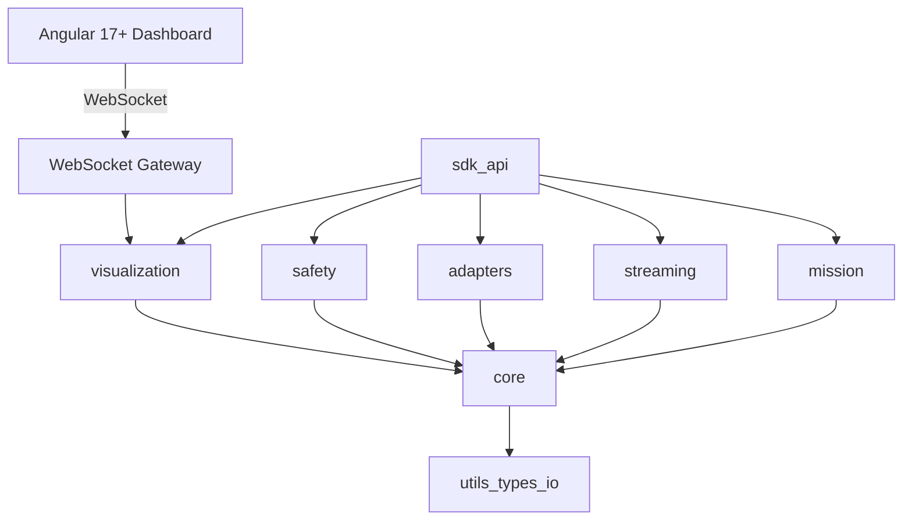

# AxonVex Framework - Architecture and Design

**Document ID:** AXVX-ARC-001  
**Version:** 2.0  
**Date:** 2026-04-07  
**Status:** Draft

---

## 1. Architecture Intent

AxonVex is a modular C++ framework for real-time processing and orchestration,
with a roadmap toward mission-style pipelines, adapter boundaries, and a coherent safety layer—without tying the design to any specific predecessor codebase.

**Implementation baseline:** the codebase targets **C++14** (`CMAKE_CXX_STANDARD 14`). Filesystem-dependent code uses `std::experimental::filesystem` behind a small compatibility alias; on Linux with GCC and on non-Apple Clang, `axonvex_core` links **`stdc++fs`**. Prefer the in-tree minimal `axonvex::optional` rather than `std::optional` until the language standard is raised.

---

## 2. Package Model



### Core rules

1. `core` MUST NOT depend on middleware-specific protocol types.
2. Adapter packages MUST translate external formats at boundaries.
3. Mission runtime MUST be executable with mock adapters.
4. Safety checks MUST be framework-level, not ad-hoc app logic.
5. The Angular dashboard MUST communicate exclusively through the WebSocket gateway — never link directly to C++ internals.
6. The WebSocket gateway MUST bridge `TelemetryBus` channels and framework state without imposing serialization choices on core.

---

## 3. Current Snapshot

### Implemented
- Runtime core and orchestration (`axonvex_core`)
- Interface units: SubscriberUnit, PublisherUnit, ServerUnit, ClientUnit with sync+async ports
- Protocol abstraction + transport scaffolds (`axonvex_interfaces`)
- Adapter contract: AdapterInterface + AdapterBase + MockAdapter (`axonvex_adapters`)
- ROS 2 plugin: ROS2Adapter with typed unit creation + type caster registry (`axonvex_ros2`)
- System adapter injection: `addAdapter()` / `getAdapter()` on AxonVexSystem
- Mission runtime: `MissionElement` + `MissionPipeline` (PU) with graph-based execution control
- Safety envelope: `SafetyManager` with policy registry, e-stop, periodic evaluation, event notification
- Plugin system, safety primitives (Watchdog), I/O, telemetry bus
- Unit-test harness: 364 tests (`tests/`, CTest/GTest)

### Next-milestone gaps
- Deterministic replay harness
- MAVLink plugin lib (`axonvex_mavlink`)
- Production WebSocket server replacing placeholder implementation
- WebSocket telemetry gateway bridging `TelemetryBus` to web clients
- Angular 17+ dashboard with real-time charts, system topology, 3D scene, log viewer, and mission/safety panels

---

## 4. Visualization Architecture

### WebSocket Telemetry Gateway (C++)

The gateway is a C++ component that sits between `TelemetryBus` / framework state and web clients:

- Subscribes to all (or selectively configured) `TelemetryBus` channels.
- Maintains per-client WebSocket connections with independent channel subscriptions.
- Serializes payloads as JSON (default) or binary (MessagePack/CBOR), negotiated at connection time.
- Exposes read-only state streams: system lifecycle, mission pipeline, adapter health, safety status, logs.
- Exposes write channels for authenticated commands: lifecycle control, config edits.

### Angular 17+ Dashboard

| Layer | Technology | Role |
|-------|-----------|------|
| Framework | Angular 17+ (standalone components, signals, new control flow) | Application shell and routing |
| State | Angular signals + RxJS for WebSocket streams | Reactive data flow |
| Charts | ngx-charts or lightweight D3 wrappers | Real-time telemetry visualization |
| 3D | Three.js via angular-three or direct integration | Spatial data rendering |
| Layout | Angular CDK drag-drop + custom resizable grid | Configurable panel system |
| Theming | Angular Material or Tailwind CSS | Light/dark mode, responsive design |
| Build | Angular CLI, served independently or embedded via reverse proxy | Decoupled from C++ build |

### Data Flow

```
C++ Framework
  └─ TelemetryBus (keyed pub/sub)
       └─ WebSocket Gateway (C++ server)
            └─ WebSocket (JSON / MessagePack)
                 └─ Angular WebSocket Service (auto-reconnect, subscription API)
                      ├─ Chart Panel (real-time line/bar/gauge)
                      ├─ Topology Panel (processing unit graph)
                      ├─ 3D Scene Panel (poses, point clouds)
                      ├─ Log Viewer Panel (severity filter, search)
                      ├─ Mission Panel (pipeline state, history)
                      ├─ Safety Panel (policies, violations, e-stop)
                      ├─ Adapter Panel (health, message rates)
                      └─ Config Inspector (browse, hot-edit)
```

---

## 5. Anti-patterns to avoid

Avoid:
- duplicate code trees,
- global warning suppression,
- singleton-heavy lifecycle control,
- hardcoded secrets,
- weak integration/contract test coverage.
