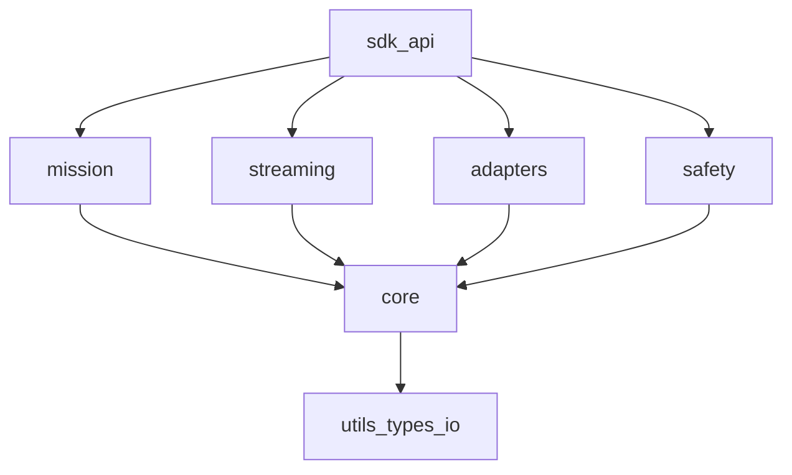

# AxonVex Framework - Architecture and Design

**Document ID:** AXVX-ARC-001  
**Version:** 2.0  
**Date:** 2026-04-07  
**Status:** Draft

---

## 1. Architecture Intent

AxonVex is a modular C++ framework for real-time processing and orchestration,
with a roadmap toward mission-style pipelines, adapter boundaries, and a coherent safety layer—without tying the design to any specific predecessor codebase.

---

## 2. Package Model

### Core rules

1. `core` MUST NOT depend on middleware-specific protocol types.
2. Adapter packages MUST translate external formats at boundaries.
3. Mission runtime MUST be executable with mock adapters.
4. Safety checks MUST be framework-level, not ad-hoc app logic.

---

## 3. Current Snapshot

### Implemented strengths
- Runtime core and orchestration (`include/axonvex/core`)
- Protocol abstraction + transport scaffolds (`include/axonvex/interfaces`)
- Unit-test harness (`tests`, CTest/GTest)

### Next-milestone gaps
- Mission runtime module
- ROS/MAVLink/PX4 adapter layer
- Safety manager and policy engine
- Non-placeholder streaming/websocket stack

---

## 4. Anti-patterns to avoid

Avoid:
- duplicate code trees,
- global warning suppression,
- singleton-heavy lifecycle control,
- hardcoded secrets,
- weak integration/contract test coverage.
