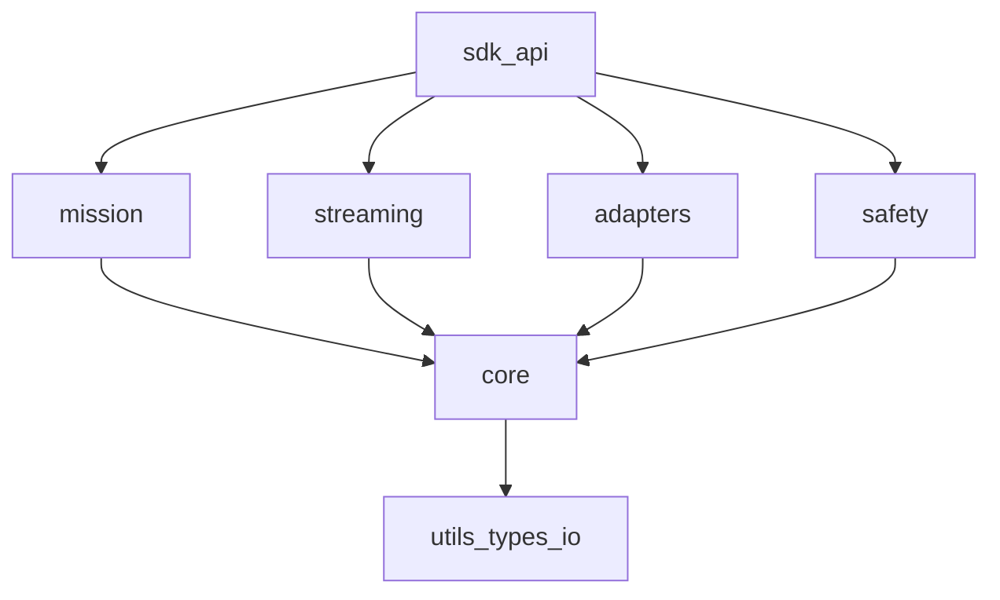

# AxonVex Framework - Architecture and Design

**Document ID:** AXVX-ARC-001  
**Version:** 2.0  
**Date:** 2026-04-07  
**Status:** Draft

---

## 1. Architecture Intent

AxonVex is a modular C++ framework for real-time processing and orchestration,
with a roadmap toward mission-style pipelines, adapter boundaries, and a coherent safety layer—without tying the design to any specific predecessor codebase.

---

## 2. Package Model

### Core rules

1. `core` MUST NOT depend on middleware-specific protocol types.
2. Adapter packages MUST translate external formats at boundaries.
3. Mission runtime MUST be executable with mock adapters.
4. Safety checks MUST be framework-level, not ad-hoc app logic.

---

## 3. Current Snapshot

### Implemented
- Runtime core and orchestration (`axonvex_core`)
- Interface units: SubscriberUnit, PublisherUnit, ServerUnit, ClientUnit with sync+async ports
- Protocol abstraction + transport scaffolds (`axonvex_interfaces`)
- Adapter contract: AdapterInterface + AdapterBase + MockAdapter (`axonvex_adapters`)
- ROS 2 plugin: ROS2Adapter with typed unit creation + type caster registry (`axonvex_ros2`)
- System adapter injection: `addAdapter()` / `getAdapter()` on AxonVexSystem
- Plugin system, safety primitives, I/O, telemetry bus
- Unit-test harness: 316 tests (`tests/`, CTest/GTest)

### Next-milestone gaps
- Mission runtime module (`MissionElement`, `MissionPipeline`)
- Safety manager and policy engine (`SafetyManager`)
- Deterministic replay harness
- MAVLink plugin lib (`axonvex_mavlink`)
- Non-placeholder streaming/websocket stack

---

## 4. Anti-patterns to avoid

Avoid:
- duplicate code trees,
- global warning suppression,
- singleton-heavy lifecycle control,
- hardcoded secrets,
- weak integration/contract test coverage.
